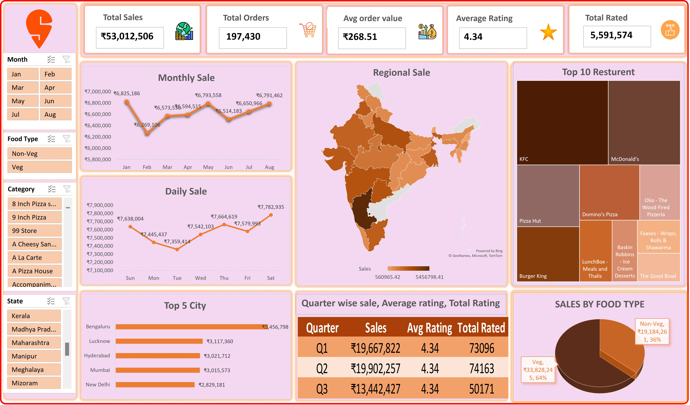

# Data Analytics Project: Swiggy Sales Performance Optimization
**Analyst:** [Md. Tarakuzzaman Faysal]  
**Objective:** Regional Revenue and Operational Performance Mapping  

---

## 🏛️ Executive Summary
This end-to-end business intelligence solution extracts, structures, and visualizes Swiggy’s national transactional sales data (comprising ₹53M+ in gross revenue and over 197,000 individual order fulfillments). 

The primary business objective was to build a localized, dynamic monitoring tool for C-suite executives to isolate regional underperformance instantly, track consumer eating preferences, and optimize weekend delivery resource allocation.

### 🖼️ Core Business Dashboard Architecture

---

## 📊 Strategic Business Insights (Executive Takeaways)

### 1. Macro Revenue Drivers
* **Platform Dominance:** Gross platform volume finalized at **₹53,012,506** across **197,430** completed orders, reflecting an institutional Average Order Value (AOV) of **₹268.51**.
* **Dietary Market Share:** Non-Vegetarian items command a staggering **64%** of gross sales volume, establishing clear inventory and marketing prioritization pathways over Vegetarian options (36%).

### 2. Geographical Value Concentration
* **The Urban Anchor:** Bengaluru acts as the primary revenue generator for the platform, driving **₹5,456,798** in sales—effectively doubling the isolated revenue streams of other Tier-1 markets like New Delhi (₹2,829,181) and Mumbai (₹3,015,573). 

### 3. Temporal Demand Cycles (Operational Optimization)
* **Weekly Revenue Bottoms:** Order volume hits an operational valley on Tuesdays at **₹7,359,414**.
* **The Weekend Spike:** Revenue surges sharply by **5.7%** heading into the weekend, peaking on Saturdays at **₹7,782,935**. 
* *Operational Recommendation:* Supply chain and logistical management should scale up active rider fleets by 6-8% on Friday/Saturday intervals to safeguard the current 4.34/5 baseline customer rating against peak-hour delays.

---

## 🛠️ Data Governance & Technical Implementation

### Data Pipeline Architecture
1. **Extraction & Separation:** Isolated raw data tables from the active calculation layers to maintain system speed and ensure absolute file stability.
2. **Geographical Data Engineering:** Overcame internal mapping engine limitations by designing a multi-tiered data schema (`Country` ➔ `State`). This forced geographic clarity, resolving spatial projection issues and achieving precise localization across all Indian states.
3. **UI/UX Optimization:** Structured an executive layout grid prioritizing KPIs at the top (F-shaped reading pattern), utilizing synchronized cross-filtering Slicers for seamless on-the-fly filtering across categories, food types, and custom calendar months.
4. **Data Presentation Standard:** Implemented professional axis sorting across all horizontal bar chart structures to ensure the highest-revenue assets are prioritized at the top for immediate executive evaluation.
